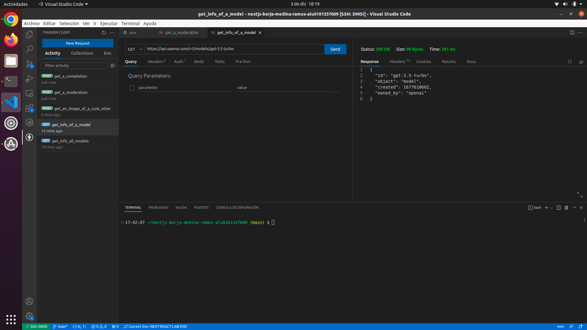
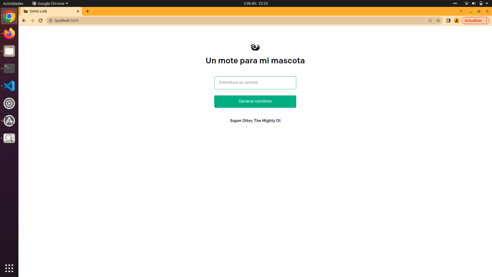

# Introducción a NextJS, React y REST

## Consultas a la API de OPENAI

- Se han realizado las diferentes consultas solicitadas:

  - Obtener todos los modelos.
  - Obtener información de un modelo.
  - Obtener una imagen linda.
  - Obtener un completion.
  - Obtener una moderación.

  

## Sitio Web para solicitar motes de máscotas.

  - En el fichero index.js se expone la función donde se muestra la interfaz de la página home así como el código para realizar una llamada fetch para solicitar un nombre aleatorio sobre el submit que el usuario haya indicado.

  - El fetch redirigirá la consulta a la ruta /api/generate donde se llama a la función sin nombre exportada y crea el completion devolviendo como resultado el nombre de la mascota.

  

## Despliegue de Netlify desde el sitio web

  - Se procede a realizar el despliegue del proyecto mediante la UI de Netlify. A continuación se muestra el resultado de
  dicho despliegue:

  

  - Tras realizar dicho despliegue se enlace el repositorio actual con la página web creada previamente. Esto permitirá realizar
  los cambios necesarios desde la CLI en el repositorio actual.

  

