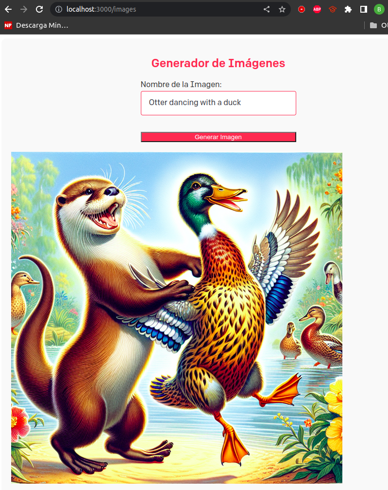

# Introducción a NextJS, React y REST

## Consultas a la API de OPENAI

- Se han realizado las diferentes consultas solicitadas:

  - Obtener todos los modelos.
  - Obtener información de un modelo.
  - Obtener una imagen linda.
  - Obtener un completion.
  - Obtener una moderación.

  

## Sitio Web para solicitar motes de máscotas.

  - En el fichero index.js se expone la función donde se muestra la interfaz de la página home así como el código para realizar una llamada fetch para solicitar un nombre aleatorio sobre el submit que el usuario haya indicado.

  - El fetch redirigirá la consulta a la ruta /api/generate donde se llama a la función sin nombre exportada y crea el completion devolviendo como resultado el nombre de la mascota.

  

## Despliegue de Netlify

  - Se procede a realizar el despliegue del proyecto mediante la UI de Netlify. A continuación se muestra el resultado de
  dicho despliegue:

  

  - Tras realizar dicho despliegue se enlace el repositorio actual con la página web creada previamente. Esto permitirá realizar
  los cambios necesarios desde la CLI en el repositorio actual.

  

  - Se realiza un chequeo del estado de la cuenta y del sitio de Netlify como las variables de entorno:

  

## Despliegue en Vercel

  - Se realiza el mismo despliegue pero en la plataforma de desarrollo y despliegue de Vercel:

  

  

  

## Ejercicio de rutas dinámicas

- El ejercicio consiste en la creación de un blog con sus diversos post utilizando los mecánismo de rutas dinámicas.
- Vease las siguientes funcionalidades utilizadas en el código:

### Funcionalidades:

#### 1. Importaciones:

- Importa elementos necesarios como el encabezado (`Head`), el diseño (`Layout`), estilos (`utilStyles`), funciones para obtener datos ordenados (`getSortedPostsData`), enlaces (`Link`), y el componente de fecha (`Date`).

#### 2. Función Principal (`Home`):

- Define un componente funcional llamado `Home` que representa la página principal del blog.
- Utiliza el componente `Layout` y establece el título de la página con el nombre del sitio (`siteTitle`).
- Contiene dos secciones: una para una introducción personalizada y otra para mostrar las publicaciones del blog.

#### 3. Introducción Personalizada:

- Dentro de la primera sección, hay un párrafo que podría ser una breve introducción personal.

#### 4. Listado de Publicaciones del Blog:

- En la segunda sección, se presenta un encabezado (`h2`) que dice "Blog".
- Luego, muestra una lista (`ul`) de enlaces a las publicaciones del blog.
- Cada publicación está representada como un elemento de lista (`li`) que contiene un enlace (`Link`) al detalle de esa publicación, el título de la publicación y la fecha de publicación.

#### 5. Obtención de Datos Estáticos (`getStaticProps`):

- Utiliza la función `getStaticProps` para obtener y ordenar los datos de todas las publicaciones del blog.
- Retorna estos datos como propiedades (`allPostsData`) que se utilizarán al renderizar la página.

#### Algunas imágenes del resultado obtenido trás el tutorial:

#### Se crea una nueva ruta donde se permite generar imágenes personalizada con el modelo Dalle.

